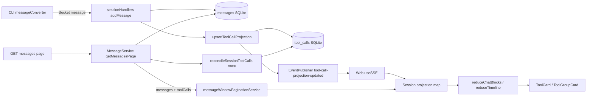

# Phase 01.2: Fix durable tool call projection in Hub — Research

**Researched:** 2026-05-25  
**Domain:** Hub SQLite derived state + Web timeline reducer hydration  
**Confidence:** HIGH (codebase-verified); MEDIUM on legacy message format coverage in reconcile

## Summary

Phase 01.2 fixes generic `Tool` cards by making Hub the canonical owner of per-`callId` tool identity. Today, CLI emits full `tool-call` wire events but stripped `tool-call-result` events; Hub persists messages only (`sessionHandlers.ts` → `store.messages.addMessage`); Web pairs start/result inside the visible window and falls back to `permissionEntry?.toolName ?? 'Tool'` on result-only paths (`reducerTimeline.ts` ~315–326).

Locked decisions (CONTEXT) prescribe: new `tool_calls` SQLite table, upsert on ingest, eager reconcile on first `getMessagesPage` per process, per-page `toolCalls` on the messages API, SSE `tool-call-projection-updated`, and Web `projectionsByCallId` in the reducer context—without changing raw messages or CLI wire.

**Primary recommendation:** Add `hub/src/sync/toolCallProjection.ts` (extract + merge, mirroring `todos.ts` / `teams.ts`), `hub/src/store/toolCalls.ts` + `ToolCallStore`, hook ingest in `sessionHandlers.ts`, enrich `MessageService.getMessagesPage`, extend `@hapi/protocol` (`ToolCallProjectionSchema`, `MessagesResponse.toolCalls`, `SyncEvent`), and carry a session-scoped projection map in the Web message-window layer (where messages already live—not unused TanStack `queryKeys.messages`).

**Schema note:** `SCHEMA_VERSION` is `11` with **no runtime migrations**—bump to `12` and add `tool_calls` to `createSchema` / `REQUIRED_TABLES`. Existing on-disk DBs will fail startup until backup/rebuild or an offline migration script (project policy per `gsd-workflow.mdc`).

## Architectural Responsibility Map

| Capability | Primary Tier | Secondary Tier | Rationale |
|------------|-------------|----------------|-----------|
| Merge tool-call + result into canonical projection | API / Backend (Hub) | — | Durable, session-scoped truth; survives pagination gaps |
| Persist projection across Hub restart | Database / Storage (SQLite `tool_calls`) | — | D-05; not in-memory-only |
| Expose projection with paginated messages | API / Backend (`GET /sessions/:id/messages`) | — | D-06/D-07 atomic page + map |
| Live projection patches | API / Backend (SSE via `EventPublisher`) | — | D-08; result may arrive before refetch |
| Session-scoped client projection cache | Browser / Client (message-window store) | — | Messages already live here; merge SSE + page fetches |
| Render tool cards from projection | Browser / Client (`reduceTimeline` / `ensureToolBlock`) | — | D-10–D-12; presentation only |
| Raw message storage & replay | API / Backend (unchanged `messages` table) | — | D-03 |
| CLI wire shape | CLI (unchanged) | — | D-13 out of scope |

<user_constraints>
## User Constraints (from CONTEXT.md)

### Locked Decisions

- **D-01:** Dedicated SQLite table `tool_calls` with composite key `(session_id, call_id)` and JSON (or normalized columns) payload. Do **not** store in `sessions.agent_state`.
- **D-02:** Upsert on every message ingest in Hub (`MessageService` / store path) when content includes `tool-call` or `tool-call-result`; idempotent, out-of-order safe.
- **D-03:** Raw messages unchanged — projection is additive.
- **D-04:** Eager `reconcileSessionToolCalls(sessionId)` on first `getMessagesPage` per Hub process lifetime (or schema bump); scans stored messages, same merge rules.
- **D-05:** SQLite durability only.
- **D-06:** Enrich `getMessagesPage` with `toolCalls: Record<callId, ToolCallProjection>` for callIds referenced in returned `messages` only.
- **D-07:** No separate REST resource for tool calls in v1.
- **D-08:** New `SyncEvent` discriminant `tool-call-projection-updated` after Hub upsert/reconcile.
- **D-09:** Web session-scoped projection map in `toolProjectionStore.ts` (module-private session Map); merge page `toolCalls` + SSE `patchProjection` (`message-received` alone insufficient; not TanStack `queryKeys.messages`).
- **D-10:** `projectionsByCallId` on `reduceChatBlocks` / `reduceTimeline` context (like `permissionsById`).
- **D-11:** Result-only path seeds `ensureToolBlock` from projection; `permissionsById` supplements approval metadata only.
- **D-12:** Reuse `ensureToolBlock` placeholder upgrade (`'Tool'` / `'unknown'`).
- **D-13:** Hub-only; no CLI wire changes.
- **D-14:** `ToolCallProjection` Zod schema in `@hapi/protocol`.

### Claude's Discretion

- `tool_calls` column layout vs JSON blob; indexes.
- SSE one projection vs batch per ingest tick.
- Reconcile trigger details (process-lifetime set vs schema flag).
- Web query-key / cache merge naming.
- Hub unit vs integration test split.

### Deferred Ideas (OUT OF SCOPE)

- CLI `tool-call-result` wire enrichment.
- `GET /sessions/:id/tool-calls` REST resource.
- Projection inside `agentState` JSON.
</user_constraints>

<phase_requirements>
## Phase Requirements

| ID | Description | Research Support |
|----|-------------|------------------|
| BUG-TOOL-01 | Durable Hub tool projection; Web correct cards after pagination/reload/reconnect when window is result-only | Maps to SPEC reqs 1–6 below (ROADMAP labels phase BUG-TOOL-01) |
| SPEC-1 | Hub canonical projection by `callId` | `tool_calls` table + upsert on ingest + merge module |
| SPEC-2 | Projection field completeness | `ToolCallProjectionSchema` + merge from `tool-call` / `tool-call-result` |
| SPEC-3 | Raw message preservation | Upsert sidecar only; `sessionModel.test.ts` tool messages unchanged |
| SPEC-4 | Web result-only rendering | `projectionsByCallId` + `reducerTimeline` seed path |
| SPEC-5 | Lifecycle durability | SQLite + reconcile + page `toolCalls` + SSE patch |
| SPEC-6 | No happy-path regression | In-window pairing unchanged; `ensureToolBlock` rules preserved |
</phase_requirements>

## Standard Stack

### Core

| Library | Version | Purpose | Why Standard |
|---------|---------|---------|--------------|
| `bun:sqlite` | Bun 1.3.14 | Hub persistence | Already used in `hub/src/store/index.ts` [VERIFIED: codebase] |
| `zod` | ^4.2.1 | Projection + SSE validation | `@hapi/protocol` boundary pattern [VERIFIED: `shared/package.json`] |
| `@hapi/protocol` | workspace | Types/schemas/events | Single contract for Hub + Web [VERIFIED: codebase] |

### Supporting

| Library | Version | Purpose | When to Use |
|---------|---------|---------|-------------|
| Vitest | ^4.0.16 | `web/`, `cli/` tests | Reducer / pagination tests |
| `bun:test` | Bun 1.3.14 | `hub/`, `shared/` tests | Store + ingest + reconcile |

### Alternatives Considered

| Instead of | Could Use | Tradeoff |
|------------|-----------|----------|
| `tool_calls` table | `agent_state` JSON blob | Rejected in D-01 — wrong aggregate |
| Page `toolCalls` map | Parallel REST fetch | Rejected in D-07 — race with pagination |
| Hub projection | CLI-only result enrichment | Rejected in D-13 — not durable across restart/windows |

**Installation:** None — no new external packages for this phase.

## Package Legitimacy Audit

> No new npm/PyPI packages. Phase uses existing workspace dependencies only.

| Package | Registry | Disposition |
|---------|----------|-------------|
| — | — | N/A |

## Architecture Patterns

### System Architecture Diagram



### Recommended Project Structure

```
hub/src/
├── store/
│   ├── toolCalls.ts          # SQL upsert/getByCallIds/scan helpers
│   └── toolCallStore.ts      # Store facade (mirror MessageStore)
├── sync/
│   ├── toolCallProjection.ts # extract events + merge + reconcile
│   └── messageService.ts     # getMessagesPage enrich + reconcile gate
├── socket/handlers/cli/
│   └── sessionHandlers.ts    # post-addMessage upsert + SSE emit
shared/src/
├── schemas.ts                # ToolCallProjectionSchema, SyncEvent arm
└── responses.ts              # MessagesResponse.toolCalls
web/src/
├── lib/
│   ├── toolProjectionStore.ts   # session map merge (new, discretion)
│   ├── messageWindowState.ts    # optional field or sibling map
│   └── messageWindowPaginationService.ts  # merge page.toolCalls
├── hooks/useSSE.ts           # handle tool-call-projection-updated
└── chat/
    ├── reducer.ts            # build projectionsByCallId Map
    └── reducerTimeline.ts    # result-only seed from projection
```

### Pattern 1: Extract tool events from stored message content (Hub)

**What:** Centralize parsing of `tool-call` / `tool-call-result` (and legacy `tool_use` / `tool_result` blocks) from persisted `content`, following `extractTodoWriteTodosFromMessageContent` and `teams.ts` `extractToolBlocks`.

**When to use:** Ingest upsert and `reconcileSessionToolCalls` full scan.

**Example:**

```typescript
// Pattern source: hub/src/sync/todos.ts, hub/src/sync/teams.ts, shared unwrapRoleWrappedRecordEnvelope
import { AGENT_MESSAGE_PAYLOAD_TYPE, unwrapRoleWrappedRecordEnvelope, isObject } from '@hapi/protocol'

export type ToolCallEvent =
    | { kind: 'start'; callId: string; name: string; input: unknown; status?: string; at: number }
    | { kind: 'result'; callId: string; output: unknown; isError: boolean; at: number }

export function extractToolCallEventsFromMessageContent(
    content: unknown,
    messageAt: number
): ToolCallEvent[] {
    const record = unwrapRoleWrappedRecordEnvelope(content)
    if (!record || (record.role !== 'agent' && record.role !== 'assistant')) return []

    const c = record.content
    if (!isObject(c)) return []

    const events: ToolCallEvent[] = []

    // Primary Cursor wire: { type: 'cursor', data: { type: 'tool-call' | 'tool-call-result', callId, ... } }
    if (c.type === AGENT_MESSAGE_PAYLOAD_TYPE) {
        const data = isObject(c.data) ? c.data : null
        if (!data || typeof data.type !== 'string') return events
        if (data.type === 'tool-call' && typeof data.callId === 'string') {
            events.push({
                kind: 'start',
                callId: data.callId,
                name: typeof data.name === 'string' ? data.name : 'unknown',
                input: data.input ?? null,
                status: typeof data.status === 'string' ? data.status : undefined,
                at: messageAt
            })
        }
        if (data.type === 'tool-call-result' && typeof data.callId === 'string') {
            events.push({
                kind: 'result',
                callId: data.callId,
                output: data.output,
                isError: Boolean(data.is_error),
                at: messageAt
            })
        }
        return events
    }

    // Legacy assistant array blocks (mirror web/src/chat/normalizeAgent.ts)
    if (Array.isArray(c)) {
        for (const block of c) {
            if (!isObject(block)) continue
            if (block.type === 'tool_use' && typeof block.id === 'string') {
                events.push({
                    kind: 'start',
                    callId: block.id,
                    name: typeof block.name === 'string' ? block.name : 'unknown',
                    input: block.input ?? null,
                    at: messageAt
                })
            }
            if (block.type === 'tool_result' && typeof block.tool_use_id === 'string') {
                events.push({
                    kind: 'result',
                    callId: block.tool_use_id,
                    output: block.content,
                    isError: Boolean(block.is_error),
                    at: messageAt
                })
            }
        }
    }

    return events
}
```

### Pattern 2: Idempotent merge into projection

**What:** Pure function `mergeToolCallProjection(prev, event) -> next` converges regardless of order; last-writer-wins for result fields; never downgrade non-placeholder `name` to empty.

**When to use:** Upsert and reconcile.

**Merge rules (prescriptive):**

| Field | From `tool-call` | From `tool-call-result` |
|-------|------------------|-------------------------|
| `callId` | set | set |
| `name` | set if non-empty | keep existing |
| `input` | set if defined | keep existing |
| `status` | map wire status | `failed` if `is_error` else `completed` |
| `result` | — | set `output` |
| `startedAt` | min(messageAt) | keep min |
| `completedAt` | — | set messageAt when result seen |

### Pattern 3: Ingest hook (mirror todos)

**What:** After `store.messages.addMessage` in `sessionHandlers.ts`, call projection upsert and emit SSE—same placement as `extractTodoWriteTodosFromMessageContent` (lines 110–116).

**Emit path:** `onWebappEvent?.({ type: 'tool-call-projection-updated', sessionId, callId, projection })` → existing `EventPublisher` validates `SyncEventSchema` in dev.

### Pattern 4: Page enrichment + reconcile gate

**What:** In `MessageService.getMessagesPage`, before returning:

1. If `sessionId` not in `reconciledSessions` Set → `reconcileSessionToolCalls(sessionId)` → add to Set.
2. Collect callIds from returned `messages` (same logic as Web `collectToolIdsFromMessages`, ideally shared helper in `@hapi/protocol` or `shared/`).
3. `toolCalls = store.toolCalls.getBySessionAndCallIds(sessionId, callIds)`.

Return `{ messages, page, toolCalls }`.

### Pattern 5: Web projection map + reducer context

**What:** Extend client state parallel to messages:

- On `fetchLatestMessages` / `fetchOlderMessages` / `backfillColdLoadMessages`: merge `response.toolCalls` into session map by `callId`.
- On SSE `tool-call-projection-updated`: patch map entry.
- `SessionChat` / `reduceChatBlocks`: `projectionsByCallId = new Map(Object.entries(sessionProjections))`.
- `reduceTimeline` tool-result branch (~315):  
  `name: projection?.name ?? permissionEntry?.toolName ?? 'Tool'`  
  `input: projection?.input ?? permissionEntry?.input ?? null`

**D-09 clarification:** `queryKeys.messages` exists in `web/src/lib/query-keys.ts` but is **unused**; messages flow through `message-window-store`. Implement D-09 on the message-window layer (session-scoped module map), not a new TanStack query, unless a future refactor moves messages into Query—see Assumptions Log A1.

### Anti-Patterns to Avoid

- **Mutating stored messages** to inject synthetic `tool-call` rows — violates D-03/SPEC-3.
- **Using `permissionsById` as canonical name** — incomplete for completed historical tools (SPEC background).
- **Full-session `toolCalls` on every page** — violates D-06 pagination rule.
- **Runtime SQLite migration in `initSchema`** — repo throws on version mismatch (`hub/src/store/index.ts`); do not add silent ALTER.

## Don't Hand-Roll

| Problem | Don't Build | Use Instead | Why |
|---------|-------------|-------------|-----|
| Tool identity across windows | Window pairing only | Hub `tool_calls` + Web map | Result wire lacks name/input [VERIFIED: `messageConverter.ts`] |
| Event schema validation | Ad-hoc SSE payloads | `SyncEventSchema` discriminated union | `EventPublisher` dev validation [VERIFIED: `eventPublisher.ts`] |
| Placeholder merge rules | New card builder | `ensureToolBlock` | Already upgrades `'Tool'`/`'unknown'` [VERIFIED: `reducerTools.ts`] |
| Permission UX metadata | Projection-only | `getPermissions(agentState)` + projection | D-11 split of concerns |

## Common Pitfalls

### Pitfall 1: Schema version 11 → 12 breaks existing DBs

**What goes wrong:** Hub refuses start with `SQLite schema version mismatch`.  
**Why:** `currentVersion !== SCHEMA_VERSION` throws; no migration path.  
**How to avoid:** Bump `SCHEMA_VERSION` to `12`, add `tool_calls` to `createSchema` + `REQUIRED_TABLES`; document rebuild/backup for single-user deploy.  
**Warning signs:** `namespace.test.ts` expects `user_version === 11` — update to `12`.

### Pitfall 2: Reconcile on every page request

**What goes wrong:** O(n) full session scan per pagination click.  
**Why:** D-04 says first `getMessagesPage` per process lifetime only.  
**How to avoid:** `Set<string>` on `MessageService` or `SyncEngine` (discretion D-04).

### Pitfall 3: SSE projection arrives after `message-received`

**What goes wrong:** Brief `Tool` flash on live result-only event.  
**Why:** Two events; handler order matters.  
**How to avoid:** Upsert projection **before** emitting `message-received` in `sessionHandlers`, or handle projection event first in `useSSE` and merge map before `ingestIncomingMessages`.

### Pitfall 4: Losing projections on message-window trim

**What goes wrong:** Trim drops old messages but cards still need identity for visible results.  
**Why:** `VISIBLE_WINDOW_SIZE` trims messages, not projections.  
**How to avoid:** Keep projection map session-scoped **outside** trimmed `messages[]` (separate Map keyed by `callId`).

### Pitfall 5: Legacy stored formats missed in reconcile

**What goes wrong:** Old sessions stay `'Tool'` after reconcile.  
**Why:** Only Cursor `tool-call` wire parsed.  
**How to avoid:** Include legacy `tool_use` / `tool_result` array parsing (Pattern 1); add hub fixture tests with both shapes.

### Pitfall 6: `invokedAt` clobbering on result path

**What goes wrong:** Tool footer shows result time not invoke time.  
**Why:** `ensureToolBlock` preserves first `invokedAt` only when second seed passes it—projection seed must not pass result message `invokedAt` on result-only create.  
**How to avoid:** Use projection `startedAt` for `createdAt` seed; omit `invokedAt` on result-only seed (existing test `reducerTimeline.test.ts` ~281–325).

## Code Examples

### Protocol: ToolCallProjection + MessagesResponse (shared)

```typescript
// shared/src/schemas.ts — new exports (shape per D-14 / SPEC-2)
export const ToolCallProjectionSchema = z.object({
    callId: z.string(),
    name: z.string(),
    input: z.unknown(),
    status: z.enum(['pending', 'in_progress', 'completed', 'failed']),
    result: z.unknown().optional(),
    startedAt: z.number(),
    completedAt: z.number().optional(),
    permission: z.object({ /* subset when available */ }).optional()
}).strict()

// shared/src/responses.ts
export type MessagesResponse = {
    messages: DecryptedMessage[]
    page: { limit: number; nextBeforeSeq: number | null; nextBeforeAt: number | null; hasMore: boolean }
    toolCalls: Record<string, z.infer<typeof ToolCallProjectionSchema>>
}
```

### SyncEvent arm

```typescript
// shared/src/schemas.ts — add to SyncEventSchema discriminated union
SessionChangedSchema.extend({
    type: z.literal('tool-call-projection-updated'),
    callId: z.string(),
    projection: ToolCallProjectionSchema
})
```

### SQLite table (schema v12)

```sql
CREATE TABLE IF NOT EXISTS tool_calls (
    session_id TEXT NOT NULL,
    call_id TEXT NOT NULL,
    projection TEXT NOT NULL,
    updated_at INTEGER NOT NULL,
    PRIMARY KEY (session_id, call_id),
    FOREIGN KEY (session_id) REFERENCES sessions(id) ON DELETE CASCADE
);
CREATE INDEX IF NOT EXISTS idx_tool_calls_session ON tool_calls(session_id);
```

### Web result-only seed (reducerTimeline)

```typescript
const projection = context.projectionsByCallId.get(c.tool_use_id)
const block = ensureToolBlock(blocks, toolBlocksById, c.tool_use_id, {
    createdAt: projection?.startedAt ?? msg.createdAt,
    // Do not pass result message invokedAt on first seed — see reducerTimeline.test.ts
    localId: msg.localId,
    meta: msg.meta,
    name: projection?.name ?? permissionEntry?.toolName ?? 'Tool',
    input: projection?.input ?? permissionEntry?.input ?? null,
    description: null,
    permission
})
```

## State of the Art

| Old Approach | Current Approach | When Changed | Impact |
|--------------|------------------|--------------|--------|
| Window-local tool pairing only | Hub-derived projection + Web hydration | Phase 01.2 | Fixes pagination/reload/SSE gaps |
| Permission map as implicit tool name | Projection canonical; permissions supplemental | Phase 01.2 | D-11 |

**Deprecated/outdated:**

- Relying on CLI `tool-call-result` to carry `name`/`input` — explicitly out of scope (D-13).

## Assumptions Log

| # | Claim | Section | Risk if Wrong |
|---|-------|---------|---------------|
| A1 | D-09 “TanStack Query” means session-scoped client cache; implement via message-window store because `queryKeys.messages` is unused | Pattern 5 | Wrong layer if team later moves messages to Query |
| A2 | Reconcile must parse legacy `tool_use`/`tool_result` arrays, not only Cursor wire | Pattern 1 | Old DB rows stay broken |
| A3 | `SCHEMA_VERSION` bump requires user DB rebuild (no runtime migration) | Pitfall 1 | Hub won't start until manual step |
| A4 | Optional permission fields on projection can be omitted in v1 if only message-derived merge is implemented | Pattern 2 | MCP approval richness deferred to Phase 3 |

## Open Questions (RESOLVED)

1. **Schema v12 migration**
   - **Resolution:** Rebuild-only — no runtime migration in `initSchema` (matches plan 02). Bump `SCHEMA_VERSION` to `12`, add `tool_calls` to `createSchema` / `REQUIRED_TABLES`. Existing on-disk DBs fail fast until backup, delete/rebuild `hapi.db`, and Hub restart. Documented in plan 02 Task 3 (`hub/README.md`). Offline `migrate-tool-calls-v12.ts` script is out of scope for this phase.

2. **SSE batching vs per-callId events**
   - **Resolution:** Per-callId `tool-call-projection-updated` events (matches plan 03). One `{ sessionId, callId, projection }` per upserted `callId` on ingest; emit before `message-received` on the same tick. Batch map deferred — not used in v1.

## Environment Availability

| Dependency | Required By | Available | Version | Fallback |
|------------|------------|-----------|---------|----------|
| Bun | hub tests, dev | ✓ | 1.3.14 | — |
| `bun:sqlite` | Hub store | ✓ | (builtin) | — |
| Vitest | web tests | ✓ | ^4.0.16 | — |
| ctx7 CLI | Doc lookup | ✗ | — | Codebase + official Zod patterns |

**Missing dependencies with no fallback:** None for implementation.

## Validation Architecture

### Test Framework

| Property | Value |
|----------|-------|
| Framework | Vitest ^4.0.16 (web/cli); bun:test (hub/shared) |
| Config file | Package `test` scripts; colocated `*.test.ts` |
| Quick run command | `cd hub && bun test path/to/file.test.ts` / `cd web && bun run test -- path` |
| Full suite command | `bun run test` (root) |

### Phase Requirements → Test Map

| Req ID | Behavior | Test Type | Automated Command | File Exists? |
|--------|----------|-----------|-------------------|-------------|
| SPEC-1 | Upsert + merge by callId | unit | `cd hub && bun test src/sync/toolCallProjection.test.ts` | ❌ Wave 0 |
| SPEC-1 | Ingest writes `tool_calls` | integration | `cd hub && bun test src/sync/sessionModel.test.ts` (extend) | ✅ extend |
| SPEC-2 | Completed projection fields | unit | `cd hub && bun test src/sync/toolCallProjection.test.ts` | ❌ Wave 0 |
| SPEC-3 | Raw messages unchanged | regression | `cd hub && bun test src/sync/sessionModel.test.ts` | ✅ |
| SPEC-4 | Result-only → real name | unit | `cd web && bun run test -- src/chat/reducerTimeline.test.ts` | ✅ extend |
| SPEC-5 | Durability across reload | unit/integration | `cd hub && bun test src/store/toolCalls.test.ts` (new store + reopen) | ❌ Wave 0 |
| SPEC-6 | Happy path + grouping | regression | `cd web && bun run test -- src/chat/toolGroups.test.ts src/chat/reducerTimeline.test.ts` | ✅ |
| D-08 | SSE schema accepts new event | unit | `cd shared && bun test src/schemas.test.ts` | ✅ extend |

### Sampling Rate

- **Per task commit:** package-scoped test file(s) for touched module
- **Per wave merge:** `bun run typecheck` + `cd hub && bun test` / `cd web && bun run test` as appropriate
- **Phase gate:** `bun run test` + `bun run typecheck` per SPEC acceptance

### Wave 0 Gaps

- [ ] `hub/src/sync/toolCallProjection.ts` + `toolCallProjection.test.ts`
- [ ] `hub/src/store/toolCalls.ts` + `toolCallStore.ts` + tests
- [ ] `shared` `ToolCallProjectionSchema`, `MessagesResponse.toolCalls`, `SyncEvent` arm + schema tests
- [ ] `web/src/lib/toolProjectionStore.ts` (or equivalent) + merge in pagination/SSE
- [ ] Update `hub/src/store/namespace.test.ts` / `index.test.ts` for schema version 12

## Security Domain

### Applicable ASVS Categories

| ASVS Category | Applies | Standard Control |
|---------------|---------|------------------|
| V2 Authentication | no | — |
| V3 Session Management | no | — |
| V4 Access Control | no (Tailscale trust model) | — |
| V5 Input Validation | yes | Zod `ToolCallProjectionSchema`; parse stored JSON with `safeParse` on read |
| V6 Cryptography | no | — |

### Known Threat Patterns

| Pattern | STRIDE | Standard Mitigation |
|---------|--------|---------------------|
| Malformed agent payloads in `messages.content` | Tampering | Extract with type guards; Zod validate projection before persist/serve |
| Oversized projection JSON | DoS | Cap JSON size at upsert (discretion); SQLite row practical limits |

## Project Constraints (from .cursor/rules/)

- **GitNexus:** Run `impact` before editing symbols; `detect_changes` before commit (`gitnexus.mdc`).
- **No backward compatibility:** Schema bump acceptable; document rebuild (`AGENTS.md`, `gsd-workflow.mdc`).
- **Test runners:** Vitest for web/cli; `bun:test` for hub/shared — do not mix.
- **Strict TS, 4-space indent, co-located tests.**
- **No cut-agent literals** per `scripts/check-no-cut-agents.sh`.

## Sources

### Primary (HIGH confidence)

- Codebase: `hub/src/socket/handlers/cli/sessionHandlers.ts`, `hub/src/sync/messageService.ts`, `hub/src/store/index.ts`, `web/src/chat/reducerTimeline.ts`, `web/src/chat/reducerTools.ts`, `cli/src/agent/messageConverter.ts`, `shared/src/schemas.ts`, `shared/src/responses.ts`
- Phase artifacts: `01.2-CONTEXT.md`, `01.2-SPEC.md`

### Secondary (MEDIUM confidence)

- `hub/src/sync/todos.ts`, `hub/src/sync/teams.ts` — ingest-sidecar patterns

### Tertiary (LOW confidence)

- None asserted without codebase anchor

## Metadata

**Confidence breakdown:**

- Standard stack: HIGH — no new deps; patterns exist in repo
- Architecture: HIGH — ingest/page/SSE/reducer paths identified
- Pitfalls: MEDIUM — legacy format coverage needs test proof

**Research date:** 2026-05-25  
**Valid until:** 2026-06-25 (stable domain); 2026-06-01 for schema/migration decision

## RESEARCH COMPLETE
