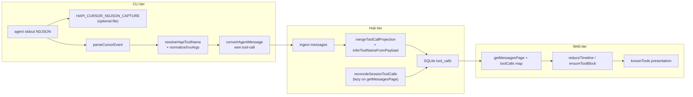

# Phase 01.3: Cursor 活动审计 — Research

**Researched:** 2026-05-26
**Domain:** Cursor `stream-json` NDJSON ingest, `*ToolCall` identity mapping, HAPI wire + Hub projection + Web ToolCard
**Confidence:** MEDIUM (codebase HIGH; real NDJSON key/arg shapes LOW until capture)

## Summary

Phase 01.2-06 already ships a generic `*ToolCall` parser (`findNativeToolCallVariant` + `resolveHapiToolName`) and maps common file/shell tools to HAPI `knownTools` names. Phase 01.2-07 already adds Hub `inferToolNameFromPayload` for legacy `unknown` rows (Bash/Grep/Glob/Read/Write/Edit/TodoWrite). **Phase 01.3 closes the remaining gap:** Task, Agent, Notebook, Skill, AskUserQuestion (and audit-discovered variants) with **correct display names and canonical input shapes**, driven by **real NDJSON evidence** from the HAPI ingest path—not synthetic fixtures alone.

The highest-risk unknown is **not** “does `taskToolCall` exist?” (PascalCase fallback already yields `Task` for any `*ToolCall` suffix) but **(1) exact NDJSON keys** (e.g. `notebookReadToolCall` vs `notebookToolCall`), **(2) native `args` field names** vs what `knownTools` / `getInputStringAny` expect (`description`, `prompt`, `notebook_path`, `questions[]`, `skill`), and **(3) legacy Hub rows** that still store `name: 'unknown'` or raw args without normalization. Capture-first (D-01–D-04) de-risks mapping; CLI `normalizeXxxArgs()` (D-09–D-10) de-risks Web presentation; moving mapping into `@hapi/protocol` (shared) lets Hub reconcile reuse the same rules without importing `cli/` (D-18).

**Primary recommendation:** Implement dev capture on `cursorRemoteLauncher` stdout lines → redact → commit fixtures → extend allowlist + per-tool normalizers in shared/CLI → extend Hub `inferToolNameFromPayload` for the five tool input shapes in the same reconcile pass (D-19–D-20); defer Task/Agent Trace nesting until wire linkage is proven (D-14).

<user_constraints>
## User Constraints (from CONTEXT.md)

### Locked Decisions

#### NDJSON sample capture
- **D-01:** Capture from **HAPI/CLI runtime** — cursor-agent stdout NDJSON stream on the ingest path (not manual Cursor IDE file export as primary source).
- **D-02:** **Dev-only flag** `HAPI_CURSOR_NDJSON_CAPTURE=1` writes captures to `~/.hapi/cursor-ndjson-capture/`; no always-on production logging.
- **D-03:** Persist **full session NDJSON** with **redaction** (paths, tokens, secrets stripped) before disk write.
- **D-04:** Commit **redacted samples** into `cli/src/cursor/utils/fixtures/` alongside existing `cursorToolCallNdjson.ts` (CI-regression friendly).

#### Mapping table coverage
- **D-05:** **Priority five** — Task, Agent, Notebook (Read/Edit), Skill, AskUserQuestion — plus any additional unmapped `*ToolCall` keys discovered during audit.
- **D-06:** **Notebook keys** — confirm real NDJSON key names from capture first (`notebookReadToolCall` / `notebookEditToolCall` vs single `notebookToolCall`); map accordingly after evidence.
- **D-07:** **Task vs Agent** — separate allowlist entries (e.g. `taskToolCall` → `Task`, `agentToolCall` / `subagentToolCall` → `Agent`); do not collapse to one HAPI name.
- **D-08:** **Unmapped keys after audit** — keep PascalCase fallback (`fooToolCall` → `Foo`) and add **warn log** `[cursor-ndjson] unmapped: {key}` for visibility.

#### Args field normalization
- **D-09:** **CLI layer primary** — normalize Cursor native args to HAPI-canonical input shapes in `cursorEventConverter` / dedicated helpers; Web should not guess Cursor-specific field names.
- **D-10:** **Per-tool `normalizeXxxArgs()`** functions (testable, one per mapped variant) rather than blanket dual-write or Web-only aliases.
- **D-11:** **AskUserQuestion** — verify shape from capture first; default **preserve** Cursor `questions[]` if Web `AskUserQuestionView` already parses it.
- **D-12:** **Skill** — verify from capture; extend Web `getInputStringAny` aliases only if needed; minimal CLI changes.

#### Web presentation depth
- **D-13:** **Incremental tiers** — eliminating "Tool" placeholder with correct **name + title/subtitle** is the hard requirement; dedicated result views only where clearly broken or missing.
- **D-14:** **Task/Agent Trace nesting** — verify whether child tool calls already arrive on HAPI wire with parent/child linkage; if not, **defer** nested Trace work to a follow-up (do not block mapping delivery).
- **D-15:** **AskUserQuestion footer** — keep existing `AskUserQuestionFooter`; ensure mapping + `isAskUserQuestionToolName` alias list covers Cursor-resolved names.
- **D-16:** **Agent results** — `GenericResultView` + markdown branch when result is text; no new `AgentResultView` in this phase.

#### Legacy session backfill
- **D-17:** **New ingest must be correct**; additionally upgrade legacy Hub projections with `name: 'unknown'` via reconcile (衔接 01.2-07).
- **D-18:** **Shared mapping logic** — extract or share `cursorToolCallMapping` allowlist so Hub reconcile reuses the same rules as CLI (not duplicate heuristics).
- **D-19:** **01.3 承接 01.2-07 剩余** — legacy unknown recovery + five advanced tool mappings in one reconcile pass (avoid two reconcile refactors).
- **D-20:** **Lazy reconcile on read** — trigger on first `getMessagesPage` per session per Hub process (matches Phase 01.2 D-04 pattern); no hub-start full scan.

### Claude's Discretion
- Exact redaction rules for capture files.
- Notebook key split vs unified mapping after sample review.
- Whether mapping module lives in `shared/` vs Hub importing CLI utility (prefer single source in `@hapi/protocol` or shared if Hub cannot import `cli/`).
- Per-tool normalize function file layout.
- Web alias additions vs CLI-only normalization tradeoffs per tool after fixture review.
- Task/Agent wire nesting investigation outcome and deferral wording in plans.

### Deferred Ideas (OUT OF SCOPE)
- Task/Agent **nested Trace** if wire lacks parent/child linkage — follow-up quick task or sub-plan after capture audit.
- New dedicated **AgentResultView** — use Generic + markdown until proven insufficient.
- Always-on NDJSON logging in production — rejected (dev flag only).
- Manual Cursor IDE session file export as primary capture path — rejected (HAPI ingest path preferred).
</user_constraints>

<phase_requirements>
## Phase Requirements

| ID | Description | Research Support |
|----|-------------|------------------|
| TOOL-AUDIT-01 | Dev capture of full session NDJSON on HAPI ingest path with redaction | Hook `cursorRemoteLauncher.runAgentProcess` line reader; `HAPI_CURSOR_NDJSON_CAPTURE=1`; `~/.hapi/cursor-ndjson-capture/` |
| TOOL-AUDIT-02 | Redacted real samples in repo fixtures for CI | Extend `fixtures/` pattern from `cursorToolCallNdjson.ts`; commit after redaction pass |
| TOOL-AUDIT-03 | Allowlist + warn for unmapped `*ToolCall` keys | Extend `CURSOR_TOOL_KEY_TO_HAPI_NAME`; log in `resolveHapiToolName` when PascalCase fallback used |
| TOOL-AUDIT-04 | Task / Agent / Notebook / Skill / AskUserQuestion mapped with usable input | Per-tool `normalizeXxxArgs` + Web `knownTools` field alignment (`description`, `prompt`, `notebook_path`, `skill`, `questions`) |
| TOOL-AUDIT-05 | Hub legacy `unknown` + advanced tools healed in one reconcile pass | Extend `inferToolNameFromPayload` + shared mapping; keep lazy reconcile in `messageService.getMessagesPage` |
| BUG-TOOL-01 (carryover) | Tool cards show real identity after pagination/reload/reconnect | Upstream CLI fix + Hub projection; extends 01.2-06/07 — human UAT still valuable for five new tools |
</phase_requirements>

## Architectural Responsibility Map

| Capability | Primary Tier | Secondary Tier | Rationale |
|------------|-------------|----------------|-----------|
| NDJSON capture (dev) | CLI (`cursorRemoteLauncher`) | — | Single ingest point: `agent` stdout → `parseCursorEvent` |
| Redaction before disk | CLI capture module | — | Secrets never hit git; D-03 |
| `*ToolCall` → HAPI name | CLI converter (+ shared module) | Hub infer (legacy only) | Wire name set at ingest; Hub heals stored placeholders |
| Args normalization | CLI (`normalizeXxxArgs`) | Hub (optional re-normalize on reconcile) | D-09: Web must not guess Cursor fields |
| Fixture / regression tests | CLI (Vitest) | Hub (bun:test) infer tests | Co-located `*.test.ts` per AGENTS.md |
| ToolCard title/subtitle | Web (`knownTools`) | — | Consumer only; verify aliases after CLI normalize |
| Durable projection | Hub (`toolCallProjection` + SQLite) | — | Already authoritative for cross-window identity |
| Lazy session reconcile | Hub (`MessageService`) | — | D-20; existing `reconciledSessions` set |
| Task/Agent Trace UI | Web (`trace.tsx`, reducer) | — | D-14: verify wire linkage; defer if missing |

## Project Constraints (from .cursor/rules/)

- **GitNexus:** Run `impact` before editing `resolveHapiToolName`, `convertCursorEventToAgentMessage`, `mergeToolCallProjection`, `reconcileSessionToolCalls` (`repo: "hapi-cursor"`, `direction: "upstream"`). Run `detect_changes` before commit.
- **AGENTS.md:** TypeScript strict; 4-space indent; co-located tests; Vitest in `cli/`/`web/`, `bun:test` in `hub/`/`shared/`; no backward compatibility; smallest change.
- **Hub must not import `cli/`** — `hub/package.json` depends only on `@hapi/protocol` [VERIFIED: hub/package.json]. Shared extraction is required for D-18 (not optional).
- **No new cut-agent literals** — `scripts/check-no-cut-agents.sh` on commit.

## Standard Stack

### Core (existing — no new packages)

| Component | Version | Purpose | Why Standard |
|-----------|---------|---------|--------------|
| `agent` CLI | env (`stream-json`) | NDJSON source | `buildAgentArgs` already uses `--output-format stream-json` [VERIFIED: cursorRemoteLauncher.ts] |
| Bun | 1.3.14 (env) | CLI/hub runtime | Repo scripts [VERIFIED: `bun --version`] |
| Vitest | ^4.0.16 | CLI tests | `cli/package.json` [VERIFIED] |
| `bun:test` | bun 1.3.x | Hub tests | AGENTS.md cross-runner rule |
| `@hapi/protocol` | workspace | Wire types, Zod | Hub/Web/CLI shared boundary |
| Zod | ^4.2.1 | Schema validation | shared + hub |

### Supporting

| Module | Location (recommended) | Purpose |
|--------|------------------------|---------|
| `cursorToolCallMapping` | **`shared/src/cursor/toolCallMapping.ts`** (move from cli) | Single allowlist + `resolveHapiToolName` for CLI + Hub |
| `normalizeToolArgs/*` | `cli/src/cursor/utils/normalizeToolArgs/` | Per-tool arg shaping (CLI-only is OK; export types from shared if Hub needs) |
| `cursorNdjsonCapture` | `cli/src/cursor/utils/cursorNdjsonCapture.ts` | Dev flag writer + redaction |
| Fixtures | `cli/src/cursor/utils/fixtures/` | Synthetic + captured redacted NDJSON |

### Alternatives Considered

| Instead of | Could Use | Tradeoff |
|------------|-----------|----------|
| `shared/` mapping | Hub duplicate heuristics | Rejected by D-18; drift risk |
| Web-only field aliases | CLI normalize | Rejected by D-09; duplicates Cursor knowledge |
| Manual IDE export | HAPI capture | Rejected by D-01 |
| New npm NDJSON/redact libs | Inline redaction + `JSON.parse` per line | Few lines; no install surface [ASSUMED: sufficient for dev capture] |

**Installation:** None required for this phase.

## Package Legitimacy Audit

> No new external packages planned. Slopcheck unavailable for `slopcheck install` subcommand at research time; gate not applicable.

**Packages removed due to slopcheck [SLOP] verdict:** none  
**Packages flagged as suspicious [SUS]:** none

## Architecture Patterns

### System Architecture Diagram



### Recommended Project Structure

```
shared/src/cursor/
  toolCallMapping.ts          # CURSOR_TOOL_KEY_TO_HAPI_NAME, resolveHapiToolName, findNativeToolCallVariant
cli/src/cursor/utils/
  cursorEventConverter.ts     # calls mapping + normalize hooks
  cursorNdjsonCapture.ts      # dev capture + redact
  normalizeToolArgs/
    index.ts
    normalizeTaskArgs.ts
    normalizeAgentArgs.ts
    normalizeNotebookReadArgs.ts
    normalizeNotebookEditArgs.ts
    normalizeSkillArgs.ts
    normalizeAskUserQuestionArgs.ts
  fixtures/
    cursorToolCallNdjson.ts           # existing synthetic
    cursorToolCallNdjson.captured.ts  # redacted real samples (new)
hub/src/sync/
  toolCallProjection.ts       # inferToolNameFromPayload extended; import shared mapping helpers
```

### Pattern 1: Capture at ingest (dev-only)

**What:** Append each raw stdout line to a session file when `process.env.HAPI_CURSOR_NDJSON_CAPTURE === '1'`, after redaction.

**When to use:** Before locking Notebook keys or AskUserQuestion arg shapes (D-06, D-11).

**Hook point:** `cursorRemoteLauncher.ts` `rl.on('line', …)` immediately before or after `parseCursorEvent` [VERIFIED: lines 195–200].

**Example:**

```typescript
// Pattern only — implement in cursorNdjsonCapture.ts
rl.on('line', (line) => {
    if (process.env.HAPI_CURSOR_NDJSON_CAPTURE === '1') {
        appendRedactedNdjsonLine(capturePath, line)
    }
    const event = parseCursorEvent(line)
    if (event) onEvent(event)
})
```

### Pattern 2: Normalize after variant resolution

**What:** `extractToolInput` returns `normalizeXxxArgs(native.key, native.variant.args)` when mapped.

**When to use:** Every allowlisted or PascalCase-resolved native tool (D-09–D-10).

**Example:**

```typescript
// In cursorEventConverter.ts (conceptual)
const native = findNativeToolCallVariant(toolCall)
if (native) {
    const name = resolveHapiToolName(toolCall)
    return normalizeToolInputForName(name, native.key, native.variant.args ?? {})
}
```

### Pattern 3: Shared mapping + Hub infer extension

**What:** Hub `inferToolNameFromPayload` gains shapes for advanced tools using **canonical** input fields (same as post-normalize wire), not duplicate NDJSON parsing.

**When to use:** Legacy rows with `name: 'unknown'` or wrong name but recognizable input (D-17, D-19).

**Align with Web `knownTools`:**

| HAPI name | Infer / normalize signals |
|-----------|---------------------------|
| Task | `description`, `name`, `team_name`, `prompt` (Task title uses description first) |
| Agent | `prompt` + `subagent_type` [VERIFIED: subagentTool.ts] |
| NotebookRead | `notebook_path` without edit signals |
| NotebookEdit | `notebook_path` + `edit_mode` / edit-shaped args |
| Skill | `skill` string |
| AskUserQuestion | `questions[]` array |

### Pattern 4: Unmapped key visibility (D-08)

**What:** When `findNativeToolCallVariant` finds a key not in `CURSOR_TOOL_KEY_TO_HAPI_NAME`, emit `logger.warn('[cursor-ndjson] unmapped: ${key}')` once per key per process (or per session) before PascalCase fallback.

### Anti-Patterns to Avoid

- **Hub importing `cli/src/cursor/**`:** Breaks package boundaries; use `shared/` [VERIFIED: hub deps].
- **Guessing Notebook key names pre-capture:** Violates D-06.
- **Collapsing Task + Agent:** Violates D-07; Web treats both as subagent tools but titles differ.
- **Second full-scan reconcile trigger:** D-20 — extend merge/infer inside existing `reconcileSessionToolCalls` only.
- **Relying on PascalCase alone:** Name may be `Task` while `knownTools` subtitle stays empty if args use Cursor-native field names.

## Don't Hand-Roll

| Problem | Don't Build | Use Instead | Why |
|---------|-------------|-------------|-----|
| NDJSON line parsing | Custom tokenizer | `parseCursorEvent` + `JSON.parse` per line | Already handles non-JSON stderr lines |
| Tool identity from args only | NLP/heuristics on arbitrary JSON | Allowlist + `*ToolCall` key scan | T-01.2-08 threat model; 01.2-06 precedent |
| Legacy name recovery | Re-parse Cursor NDJSON from Hub | `inferToolNameFromPayload` on **stored wire input** | Messages store wire envelope, not raw NDJSON |
| Redaction | Full secret-scanning SaaS | Regex/path/token rules in capture module | Dev-only, local disk (D-02) |
| New ToolCard system | Parallel registry | Extend `knownTools` + minimal aliases | D-13 incremental |

## Common Pitfalls

### Pitfall 1: PascalCase name with empty card

**What goes wrong:** `taskToolCall` → `Task` via fallback, but args use Cursor-only keys → `getInputStringAny` returns null → title "Task", empty subtitle, looks like placeholder.

**Why:** Normalization skipped; Web expects `description` / `prompt` / `notebook_path`.

**How to avoid:** D-09–D-10 normalizers; fixture tests assert non-empty `getToolPresentation` titles.

### Pitfall 2: Notebook key mismatch

**What goes wrong:** Map `notebookToolCall` → `NotebookRead` while CLI emits `notebookReadToolCall` / `notebookEditToolCall`.

**How to avoid:** Capture-first (D-06); separate allowlist entries and normalizers per key.

### Pitfall 3: Hub/CLI mapping drift

**What goes wrong:** CLI allowlist updated; Hub infer still uses old heuristics.

**How to avoid:** D-18 shared module; Hub imports `inferHapiToolNameFromInput` derived from same canonical shapes.

### Pitfall 4: Orphan in-progress tool calls after reconnect

**What goes wrong:** Cursor `stream-json` may drop `tool_call:completed` after connection retry [CITED: forum.cursor.com tool_call completed lost].

**How to avoid:** Out of scope for mapping table, but planner should note Hub projection may stay `in_progress` — optional follow-up, not 01.3 blocker.

### Pitfall 5: 01.2-07 scope overlap

**What goes wrong:** Re-implementing Bash/Grep infer from scratch.

**How to avoid:** D-19 — **extend** `inferToolNameFromPayload` only for five advanced tools + shared mapping; keep existing Bash/Read tests green.

## Code Examples

### Existing ingest hook (capture attaches here)

```195:200:cli/src/cursor/cursorRemoteLauncher.ts
            const rl = createInterface({ input: child.stdout, crlfDelay: Infinity });
            rl.on('line', (line) => {
                const event = parseCursorEvent(line);
                if (event) {
                    onEvent(event);
                }
            });
```

### Mapping allowlist extension (planner template)

```typescript
// shared/src/cursor/toolCallMapping.ts — keys MUST be confirmed from capture
export const CURSOR_TOOL_KEY_TO_HAPI_NAME: Record<string, string> = {
    // ... existing read/write/grep/...
    taskToolCall: 'Task',
    agentToolCall: 'Agent',
    subagentToolCall: 'Agent',
    // notebookReadToolCall / notebookEditToolCall: TBD after capture
    skillToolCall: 'Skill',
    askUserQuestionToolCall: 'AskUserQuestion',
}
```

### Web canonical input fields (verify after normalize)

```63:77:web/src/components/ToolCard/knownTools.tsx
    Task: {
        icon: () => <RocketIcon className={DEFAULT_ICON_CLASS} />,
        title: (opts) => {
            const name = getInputStringAny(opts.input, ['name'])
            const teamName = getInputStringAny(opts.input, ['team_name'])
            if (name && teamName) return `Agent: ${name}`
            const description = getInputStringAny(opts.input, ['description'])
            return description ?? 'Task'
        },
        subtitle: (opts) => {
            const prompt = getInputStringAny(opts.input, ['prompt'])
            return prompt ? truncate(prompt, 120) : null
        },
```

### Lazy reconcile (unchanged trigger)

```60:64:hub/src/sync/messageService.ts
        if (!this.reconciledSessions.has(sessionId)) {
            reconcileSessionToolCalls(sessionId, this.store)
            this.reconciledSessions.add(sessionId)
        }
```

## State of the Art

| Old Approach | Current Approach | When Changed | Impact |
|--------------|------------------|--------------|--------|
| 3-branch `extractToolName` (read/write/function only) | Generic `*ToolCall` variant scan | Phase 01.2-06 | Grep/shell/edit mapped |
| Window-only tool pairing | Hub SQLite `tool_calls` + page enrichment | Phase 01.2-02–05 | Pagination fix |
| No legacy infer | `inferToolNameFromPayload` | Phase 01.2-07 | Bash/Read/etc. unknown rows |
| Synthetic fixtures only | **This phase:** captured redacted NDJSON | 01.3 | Closes Task/Agent/Notebook/Skill/AskUserQuestion gap |

**Deprecated/outdated:**
- Hub-only wire fix without CLI (01.2 D-13) — still true; 01.3 is CLI-first + Hub infer extension.
- Public `cursor-agent.d.ts` subsets (read/write/bash/edit only) — incomplete vs production stream [CITED: hivehub rulebook types]; do not treat as exhaustive.

## Assumptions Log

| # | Claim | Section | Risk if Wrong |
|---|-------|---------|---------------|
| A1 | Production Cursor emits `taskToolCall` / `agentToolCall` (or similar `*ToolCall` suffix) for subagents | Mapping | Capture shows `function` wrapper only — need different branch |
| A2 | `askUserQuestionToolCall` uses `questions[]` compatible with `parseAskUserQuestionInput` | AskUserQuestion | May need CLI transform (D-11) |
| A3 | Notebook tools use `notebook_path` or alias mappable in normalizer | Notebook | Web titles stay "Read notebook" generic |
| A4 | PascalCase fallback is acceptable for audit-discovered tools until allowlisted | D-08 | Wrong display name if key suffix is ambiguous |
| A5 | 01.2-07 infer for Bash/Grep/etc. is complete and should not be reworked | Legacy | Duplicate work if planner reopens 01.2-07 |
| A6 | No new npm packages needed for capture/redaction | Standard Stack | Under-redaction if regex too weak |

## Open Questions

1. **Exact NDJSON keys for Notebook and AskUserQuestion**
   - What we know: Web expects `NotebookRead` / `NotebookEdit` and `questions[]`; trigger.dev demo lists only shell/read/edit/write/grep/ls/glob/todo [CITED: github triggerdotdev cursor-events.ts].
   - What's unclear: Real Cursor key names for notebook/skill/ask-user.
   - Recommendation: Wave 0 human step — run one HAPI session per tool with `HAPI_CURSOR_NDJSON_CAPTURE=1`, then lock allowlist from files.

2. **Task vs Agent arg discrimination on legacy infer**
   - What we know: Both share `prompt` + `subagent_type`; Task title prefers `description`.
   - Recommendation: If only `prompt` present → `Agent`; if `description` or `name`/`team_name` → `Task`; document in infer tests.

3. **Wire parent/child linkage for Trace (D-14)**
   - What we know: `reducerTimeline` suppresses duplicate prompt text for subagent tools; `trace.tsx` uses `isSubagentToolName`.
   - Recommendation: Grep wire messages for `parentCallId` / nested `call_id` during capture session; if absent, explicit deferral note in PLAN.

## Environment Availability

| Dependency | Required By | Available | Version | Fallback |
|------------|------------|-----------|---------|----------|
| Bun | cli/hub test | ✓ | 1.3.14 | — |
| Node | tooling | ✓ | v20.18.2 | — |
| `agent` (Cursor CLI) | Capture & runtime | ✓ (assumed on dev machine) | — | Capture blocked; synthetic fixtures only |
| Vitest | CLI tests | ✓ | ^4.0.16 | — |
| `~/.hapi/` writable | Capture dir | ✓ (typical) | — | Use `$HOME/.hapi/cursor-ndjson-capture/` |

**Missing dependencies with no fallback:**
- None for implementation; **capture quality** depends on `agent` on PATH during dev sessions.

## Validation Architecture

### Test Framework

| Property | Value |
|----------|-------|
| Framework | Vitest ^4.0.16 (cli), bun:test (hub) |
| Config file | `cli/vitest` (via package.json), hub implicit bun test |
| Quick run command | `cd cli && bunx vitest run src/cursor/utils/cursorToolCallMapping.test.ts src/cursor/utils/cursorEventConverter.test.ts` |
| Full suite command | `bun run typecheck && bun run test` |

### Phase Requirements → Test Map

| Req ID | Behavior | Test Type | Automated Command | File Exists? |
|--------|----------|-----------|-------------------|-------------|
| TOOL-AUDIT-01 | Capture writes redacted lines when flag set | unit | `cd cli && bunx vitest run src/cursor/utils/cursorNdjsonCapture.test.ts` | ❌ Wave 0 |
| TOOL-AUDIT-02 | Captured fixture converts to expected name | unit | `cd cli && bunx vitest run src/cursor/utils/cursorEventConverter.test.ts -t "captured"` | ❌ Wave 0 |
| TOOL-AUDIT-03 | Unmapped key warns + PascalCase | unit | `cd cli && bunx vitest run src/cursor/utils/cursorToolCallMapping.test.ts` | ✅ extend |
| TOOL-AUDIT-04 | Five tools: name + non-empty presentation inputs | unit | converter + optional web `knownTools` snapshot | ❌ Wave 0 |
| TOOL-AUDIT-05 | Legacy unknown → Task/Agent/etc. after reconcile | unit | `cd hub && bun test src/sync/toolCallProjection.test.ts -t "infer"` | ✅ extend |
| BUG-TOOL-01 | Result-only page shows non-placeholder | integration | `cd hub && bun test src/sync/sessionModel.test.ts` | ✅ extend |

### Sampling Rate

- **Per task commit:** `cd cli && bunx vitest run src/cursor/utils/cursorEventConverter.test.ts` (or mapping-only if narrower change)
- **Per wave merge:** `bun run typecheck && cd hub && bun test src/sync/toolCallProjection.test.ts`
- **Phase gate:** `bun run typecheck && bun run test && bash scripts/check-no-cut-agents.sh`

### Wave 0 Gaps

- [ ] `cli/src/cursor/utils/cursorNdjsonCapture.ts` + test — TOOL-AUDIT-01
- [ ] `cli/src/cursor/utils/fixtures/cursorToolCallNdjson.captured.ts` — TOOL-AUDIT-02 (blocked on capture session)
- [ ] `cli/src/cursor/utils/normalizeToolArgs/*.ts` + tests — TOOL-AUDIT-04
- [ ] `shared/src/cursor/toolCallMapping.ts` + `shared/package.json` export — D-18
- [ ] Hub infer cases for Task/Agent/Notebook/Skill/AskUserQuestion — TOOL-AUDIT-05

## Security Domain

### Applicable ASVS Categories

| ASVS Category | Applies | Standard Control |
|---------------|---------|------------------|
| V2 Authentication | no | — |
| V3 Session Management | no | — |
| V4 Access Control | no | — |
| V5 Input Validation | yes | Zod on protocol types; normalize functions return plain objects (no eval) |
| V6 Cryptography | no | Redaction reduces accidental secret persistence in fixtures |

### Known Threat Patterns

| Pattern | STRIDE | Standard Mitigation |
|---------|--------|---------------------|
| Secret leakage via capture files | Information Disclosure | Redact tokens/paths before write (D-03); never commit raw captures |
| Tool identity spoofing via args | Tampering | Allowlist `*ToolCall` keys first; infer returns null when ambiguous (01.2-07 pattern) |
| Log injection via NDJSON lines | Tampering | Parse JSON only; ignore non-JSON lines (existing) |

## Sources

### Primary (HIGH confidence)
- Codebase: `cli/src/cursor/utils/cursorToolCallMapping.ts`, `cursorEventConverter.ts`, `cursorRemoteLauncher.ts`
- Codebase: `hub/src/sync/toolCallProjection.ts`, `messageService.ts`
- Codebase: `web/src/components/ToolCard/knownTools.tsx`, `askUserQuestion.ts`, `subagentTool.ts`
- Phase artifacts: `01.3-CONTEXT.md`, `01.2-06-SUMMARY.md`, `01.2-07-SUMMARY.md`, `tool-call-placeholder-unknown-name.md`

### Secondary (MEDIUM confidence)
- [hivehub rulebook cursor-agent.d.ts](https://cdn.jsdelivr.net/npm/@hivehub/rulebook@5.2.1/dist/agents/cursor-agent.d.ts) — partial tool_call union (read/write/bash/edit only)
- [trigger.dev cursor-cli-demo cursor-events.ts](https://github.com/triggerdotdev/examples/blob/main/cursor-cli-demo/lib/cursor-events.ts) — subset of ToolCallKind
- [Cursor forum: tool_call completed lost on reconnect](https://forum.cursor.com/t/tool-call-completed-event-lost-after-connection-reconnect-in-stream-json-mode/157593)

### Tertiary (LOW — validate via capture)
- WebSearch community parsers — Task/Agent/Notebook key names not confirmed in authoritative Cursor docs in this session

## Metadata

**Confidence breakdown:**
- Standard stack: HIGH — repo-verified, no new deps
- Architecture: HIGH — ingest/projection path clear; shared extraction is the main structural change
- Pitfalls: MEDIUM — advanced tool arg shapes need capture (A1–A3)
- Pitfalls (reconnect orphan): MEDIUM — forum report, not reproduced locally

**Research date:** 2026-05-26  
**Valid until:** ~2026-06-26 (stable mapping); ~7 days for capture-derived key names once Cursor CLI updates

---

## RESEARCH COMPLETE

**Phase:** 01.3 - Cursor session NDJSON / advanced ToolCall mapping  
**Confidence:** MEDIUM

### Key Findings

- 01.2-06/07 already fix generic `*ToolCall` and legacy Bash/Read-style `unknown` rows; 01.3 targets **five advanced tools + args normalization + shared mapping**, not a greenfield parser.
- PascalCase fallback may already set names like `Task`; **empty ToolCard subtitles** likely mean missing **normalizeXxxArgs**, not missing allowlist entries.
- Hub **cannot** import `cli/` — move mapping to **`shared/src/cursor/`** and extend `inferToolNameFromPayload` for canonical advanced-tool input shapes in one pass (D-18–D-20).
- Capture hooks belong in **`cursorRemoteLauncher` stdout line handler**; committed redacted fixtures should drive TDD after Wave 0 capture sessions.
- Public Cursor typings and demo parsers are **incomplete** vs production; do not plan Notebook/AskUserQuestion keys without capture evidence (D-06, D-11).

### File Created

`.planning/phases/01.3-cursor-session-ndjson-toolcall-task-agent-notebook-skill-ask/01.3-RESEARCH.md`

### Confidence Assessment

| Area | Level | Reason |
|------|-------|--------|
| Standard stack | HIGH | All tooling in-repo today |
| Architecture | HIGH | Clear CLI → Hub → Web flow; shared module is prescribed |
| Pitfalls | MEDIUM | NDJSON key/arg shapes unverified until capture |

### Open Questions

- Exact `*ToolCall` keys for Notebook / Skill / AskUserQuestion
- Task vs Agent legacy infer when only `prompt` is stored
- Whether wire format includes parent/child call linkage for Trace

### Ready for Planning

Research complete. Planner can create PLAN.md with Wave 0 = capture + fixtures, Wave 1 = shared mapping + normalizers + tests, Wave 2 = Hub infer extension + regression.
